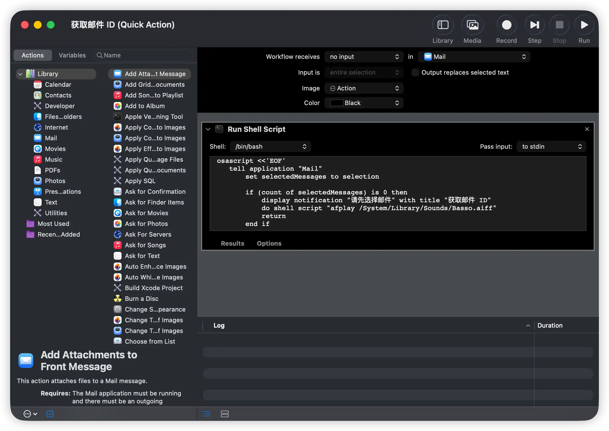

# Mail MCP Bridge

> 通过模型上下文协议(MCP)连接 macOS Mail 和 AI

**Mail MCP Bridge** 让 AI 助手（如 Claude、ChatGPT）能够直接访问和分析你的 macOS Mail 邮件。只需在 Mail 中复制 Message-ID 并粘贴给 AI——无需手动导出邮件。


**演示: 实际使用效果** (点击观看)

[]

*内容: 从 Mail 复制 Message-ID → AI 分析邮件内容*

[English](README.md)

## 🎯 项目简介

**问题**: 现实中的大量沟通通过邮件进行——项目协作、客户沟通、商务谈判、技术支持。手动导出邮件让 AI 分析非常繁琐低效。

**解决方案**: Mail MCP Bridge 通过简单的工作流让 AI 直接读取邮件:

- 在 Mail 中复制 Message-ID (一个键盘快捷键)
- 粘贴给 AI
- AI 瞬间分析邮件内容

**使用场景**:

- 📋 通过邮件线程跟踪项目进展
- 💼 从商务沟通中提取关键信息
- 🔍 总结长邮件对话
- 📊 提取结构化数据（需求、反馈、承诺）
- 🤝 回顾对话历史

**专注**: 只提取纯文本内容（无附件、无 HTML）——完美适配 AI 分析。

## ✨ 特性

- 📧 **直接访问** - AI 通过 MCP 协议读取邮件
- 🧵 **线索支持** - 一个 Message-ID 获取完整对话
- ⚡ **极速** - 毫秒级查询响应
- 🎯 **纯文本** - 干净的文本提取，为 AI 优化
- 🔒 **隐私优先** - 本地运行，邮件永不离开你的 Mac

## 🚀 快速开始

### 前置要求

- macOS 12.0+ (带 Mail 应用)
- Python 3.9+
- MCP 兼容的 AI 助手 (如 Claude Desktop)

### 安装

```bash
# 克隆仓库
git clone https://github.com/fatbobman/mail-mcp-bridge.git
cd mail-mcp-bridge

# 安装 MCP 依赖
pip3 install mcp
```

### 配置 Claude Desktop

1. **找到配置文件位置**:

   ```bash
   ~/Library/Application Support/Claude/claude_desktop_config.json
   ```

2. **编辑配置** (如果不存在则创建):

   ```json
   {
     "mcpServers": {
       "mail": {
         "command": "python3",
         "args": [
           "/path/to/mail-mcp-bridge/mail_mcp_server.py"
         ]
       }
     }
   }
   ```

   **重要**: 将 `/path/to/mail-mcp-bridge` 替换为实际的项目路径。

3. **重启 Claude Desktop** (完全退出后重新打开)

### 设置 Mail Quick Action

在 Mail 应用中添加"复制 Message-ID"按钮:

**详细步骤**:

1. 打开 **Automator** (`⌘ + 空格`，输入 "Automator")

2. 创建新的 **Quick Action**:
   - File → New (`⌘ + N`)
   - 选择 "Quick Action"
   - Workflow receives current: **no input**
   - in: **Mail.app**

3. 添加 **Run Shell Script** 动作:
   - 在左侧面板搜索 "Run Shell Script"
   - 拖拽到工作流区域
   - Shell: `/bin/bash**

4. 复制脚本内容:

   ```bash
   cat automator_script.sh
   ```

   将完整输出粘贴到 Automator 脚本区域

5. 保存为 **"Copy Message-ID"**

6. (可选) 分配键盘快捷键:
   - 系统设置 → 键盘 → 键盘快捷键
   - 服务 → Mail → "Copy Message-ID"
   - 添加快捷键 (如 `⌘ + ⇧ + C`)

**Automator 设置示例**:



**测试**:

1. 打开 Mail 应用
2. 选择任意邮件
3. 按下快捷键 (如果已配置)
4. 应该听到提示音，确认 Message-ID 已复制

## 📖 使用方法

### 基本工作流

```
1. 在 Mail 中选择邮件
2. 按下快捷键 (如 ⌘⇧C)
3. 粘贴 Message-ID 给 AI
```

### 对话示例

**读取单封邮件**:

```
你: 请分析这封邮件: <message-id@example.com>

AI: 我来读取这封邮件...
[AI 读取并分析邮件内容]
```

**读取邮件线索**:

```
你: <message-id@example.com> 的完整对话是什么?

AI: 我来检索整个线索...
[AI 显示对话中的所有邮件]
```

**实际使用场景**:

```
你: 请总结我们与商业伙伴的所有沟通，
包括他们的需求、承诺的时间表和行动项。

AI: 我来阅读相关的邮件线索并提取关键信息...
[AI 分析邮件内容，整理项目进展、承诺和行动项]
```

## 🛠️ MCP 工具

| 工具 | 描述 |
|------|------|
| `get_email_path` | 获取单封邮件的文件路径 |
| `get_thread_paths` | 获取邮件线索中的所有路径 |
| `read_email` | 读取单封邮件内容 |
| `read_thread` | 读取整个邮件线索 |

📖 **[→ 详细 API 文档](TOOLS.md)**

## 🏗️ 工作原理

```
┌─────────────┐
│  Mail App   │ 选择邮件 → 复制 Message-ID (⌘⇧C)
└──────┬──────┘
       │
       ↓ Message-ID
┌─────────────┐
│MCP Server   │ 1. 查询 Mail SQLite 数据库
│             │ 2. 通过 ROWID 定位 .emlx 文件
│             │ 3. 解析邮件内容
│             │ 4. 提取纯文本
└──────┬──────┘
       │
       ↓ 结构化数据
┌─────────────┐
│ AI Assistant│ 分析邮件内容
└─────────────┘
```

🔧 **[→ 技术架构](ARCHITECTURE.md)**

## 🐛 故障排除

### MCP 服务器未找到

**解决方案**:

```bash
# 验证 claude_desktop_config.json 中的路径
cat ~/Library/Application\ Support/Claude/claude_desktop_config.json

# 重启 Claude Desktop (完全退出后重新打开)
```

### 找不到邮件

**可能原因**:

1. Message-ID 格式不正确 (必须包含 `< >`)
2. 邮件已从 Mail 中删除
3. 邮件在不同账户的数据库中

### 权限被拒绝

**解决方案**:

```bash
# 使脚本可执行
chmod +x *.py *.sh
```

## 🔒 隐私与安全

- ✅ **本地处理**: 所有操作在你的 Mac 上本地运行
- ✅ **无外部服务器**: 不向外部服务器发送数据
- ✅ **无遥测**: 无分析或跟踪
- ✅ **只读**: 只读取邮件数据，从不修改

## 📚 文档

- **[TOOLS.md](TOOLS.md)** - 完整的 MCP 工具 API 参考
- **[ARCHITECTURE.md](ARCHITECTURE.md)** - 技术架构和数据库结构
- **[README.md](README.md)** - English Documentation

## 📝 许可证

MIT License - 详见 [LICENSE](LICENSE) 文件。

## 🤝 贡献

欢迎贡献！请随时提交 Pull Request。

## 🌟 致谢

- 为 MCP (模型上下文协议) 生态系统构建
- 灵感来源于连接邮件和 AI 的需求
- 在 macOS 26 (Tahoe) 的 Claude Desktop 上测试

## 📮 联系方式

- **问题反馈**: <https://github.com/fatbobman/mail-mcp-bridge/issues>
- **作者**: Fatbobman

## ☕ 请我喝杯咖啡

如果你觉得这个项目有帮助,欢迎请我喝杯咖啡!

[](https://buymeacoffee.com/fatbobman)

---

**用 ❤️ 为 AI 社区打造**
